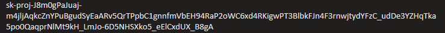

# Privacy Policy Reader

**Authors:** Nathan Schluessler, Thomas Gherna, and Evan Futey  
**Course:** CS 4930 — Privacy and Censorship  
**Instructor:** Dr. Serena Sullivan  
**University of Colorado Colorado Springs**  
**Date:** Fall 2025  

---

## Project Overview

Modern privacy policies are lengthy, dense, and filled with legal and technical jargon that users rarely read.  
The Privacy Policy Reader is a Chrome browser extension that automatically extracts, summarizes, and simplifies privacy policies using OpenAI’s ChatGPT API.
It is designed to work with the Google Chrome browser, but may work with other Chromium based browsers.

The goal is to help users quickly understand:

- What data is collected  
- How their data is used  
- Whether their data is shared  
- How long the site retains data  
- What rights they have  

This tool enables users to make informed decisions about their personal privacy with minimal effort.

---

## Features

- **Automatic Summarization**  
  Gives the user the option between gpt-4o-mini, gpt-4o, and gpt-4.1-mini to generate a 150–250 word summary of any privacy policy.

- **Automated Text Extraction**  
  `content.js` detects and extracts privacy policy text automatically from webpages.

- **Readable Bullet-Point Output**  
  Summaries are grouped into intuitive categories:
  - Data collected  
  - Data usage  
  - Third-party sharing  
  - Retention practices  
  - User rights and opt-out options  
  - Contact information  

- **Multiple Summary Styles**  
  - Standard  
  - Risk-Focused  
  - Child-Friendly  
  - Executive  

- **Clean, Updated UI**  
  Modern and responsive popup with improved layout and styling.

- **Secure Storage of API Keys**  
  API key saved using **both**:
  - `chrome.storage.sync` (encrypted sync across devices)  
  - `chrome.storage.local` (fallback for privacy-focused setups)

- **Background Notifications**  
  Extension automatically notifies the user when a privacy policy is detected.

---

## Architecture

| Component | Description |
|----------|-------------|
| **content.js** | Locates and extracts privacy policy text from websites. |
| **popup.html / popup.js / popup.css** | User interface where text is summarized and displayed. |
| **background.js** | Handles notifications, API requests, and secure key retrieval from storage. |
| **options.html / options.js** | Allows the user to securely enter and save their OpenAI API key and model selection. |
| **manifest.json** | Chrome MV3 extension configuration and permissions. |
| **icons/** | Full icon set (16×, 48×, 128×). |

---

## How It Works

### 1. **Extraction**
`content.js` scans pages for large text blocks commonly found in privacy policies and isolates them.

### 2. **Notification**
When a potential privacy policy is detected, `background.js` sends a Chrome notification encouraging the user to summarize it.

### 3. **Summarization**
The popup sends the extracted (or manually pasted) text to the background script, which calls OpenAI using the saved API key.

### 4. **Display**
The model’s structured summary is rendered in the popup with a clean, bullet-point style.

---

## Installation & Usage

### **1. Load the Extension**
- Go to your browser's extensions page, e.g. `chrome://extensions/` or `edge://extensions/`
- Enable **Developer Mode**
- Select **Load Unpacked**
- Choose the folder containing `manifest.json`

### **2. Enter Your API Key**
- Open the extension’s **Options Page**
  - Enter your OpenAI API key: 
    Note: For security reasons, this OpenAI API key is restricted to a low budget intended only for the peer review and grading of this project.
- Choose the preferred model (default: `gpt-4o-mini`)
- Save settings (securely stored using encrypted browser storage)

### **3. Use the Extension**
- Navigate to any website  
- Receive a notification when a privacy policy is detected  
- Open the popup  
- Summarize automatically extracted text or paste your own  
- Select your preferred summary style  
- Copy and use the generated summary  

---

## Security Note

Your API key is:

- **Manually entered** by the user  
- **Stored securely** using both `storage.sync` and `storage.local`  
- **Encrypted by browser’s storage layer**  
- **Never hard-coded**, logged, or transmitted except directly to OpenAI over HTTPS  
- **Never sent to websites or other extensions**

If your key becomes exposed, revoke it in the OpenAI Dashboard.

---

## Technologies Used

| Category | Tools / Libraries                                     |
|----------|-------------------------------------------------------|
| **Languages** | JavaScript, HTML5, CSS3                               |
| **Frameworks** | Chrome Extensions Manifest V3, OpenAI SDK             |
| **Version Control** | GitHub                                                |
| **Testing** | Manual testing across different browsers and versions |

---

## Deliverables

| Task | Owner | Status |
|------|--------|--------|
| Browser Extension Framework | Nathan | **Complete** |
| Automated Text Extraction | Evan | **Complete** |
| Text Highlight Function | Evan | **Complete** |
| OpenAI Integration (API) | Thomas | **Complete** |
| Browser Extension UI | Thomas | **Complete** |
| Background Notifications | Nathan | **Complete** |
| Options Page & Key Storage | Thomas | **Complete** |
| Ethical & Legal Write-Up | Team | **Complete** |
| Final Testing | Team | **Complete** |

---

## Supported Websites

The extension has been fully tested and confirmed to work on the following websites, where it automatically detects and extracts privacy policy text:

- **NFL** – https://www.nfl.com/legal/privacy/  
- **ASUS** – https://www.asus.com/us/terms_of_use_notice_privacy_policy/privacy_policy 
- **Reddit** – https://www.reddit.com/en-us/policies/privacy-policy
- **Amazon** – https://www.amazon.com/privacy  

These sites represent a range of different webpage structures and policy formats, enabling thorough validation of the extraction and summarization pipeline.

While these are the primary verified test cases, **the extension also works on many other websites**, depending on how the privacy policy is formatted. Extraction accuracy may vary across sites that:

- Load policy content dynamically  
- Use highly interactive or script-rendered layouts  
- Embed text in non-standard HTML components  

We continue to refine scraping logic to improve compatibility across additional sites.

---

## References

- Harkous, H., et al. (2018). *Polisis: Automated analysis and presentation of privacy policies using deep learning.*  
- Kelley, P. G., et al. (2009). *A “Nutrition Label” for Privacy.*  
- Wagner, I. (2023). *Privacy Policies Across the Ages.*  
- Obar, J. A., & Oeldorf-Hirsch, A. (2018). *The Biggest Lie on the Internet.*  
- McDonald, A. M., et al. (2009). *A Comparative Study of Online Privacy Policies and Formats.*  
- Reidenberg, J. R., et al. (2014). *Disagreeable Privacy Policies.*  

---

## Disclaimer

This extension provides **AI-generated summaries** and may omit essential legal details.  
Always refer to the **official privacy policy** for authoritative information.

---

© 2025 — UCCS CS 4930 Privacy & Censorship Project
